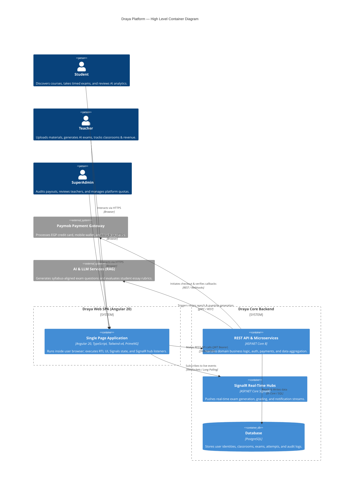
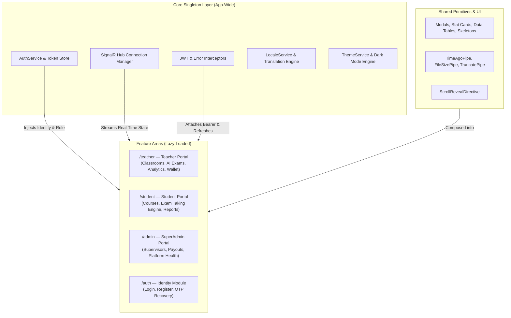
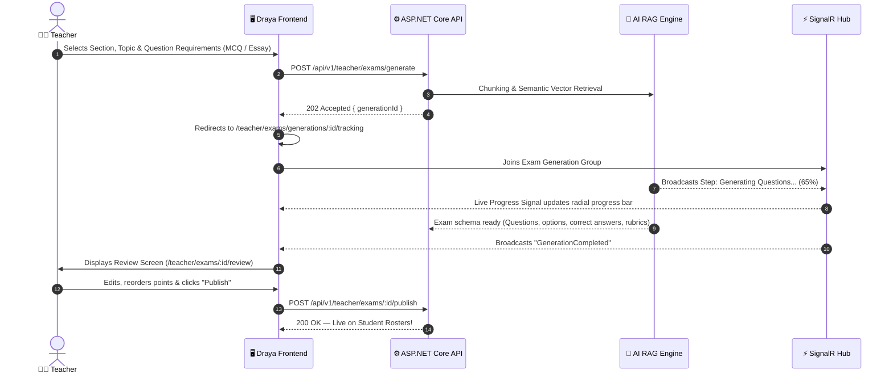

# 🎓 Draya (درايَة) — Next-Gen Arabic AI-Powered EdTech Ecosystem

[](https://angular.dev/)
[](https://www.typescriptlang.org/)
[](https://tailwindcss.com/)
[](https://primeng.org/)
[](https://learn.microsoft.com/aspnet/core/signalr/)
[](https://playwright.dev/)
[](https://iti.gov.eg/)

> **Draya (درايَة)** is an enterprise-grade, Arabic-first, AI-orchestrated Learning Management and Automated Assessment Platform built for the Egyptian secondary education market. Designed with modern **Angular 20 Standalone Architecture**, it seamlessly connects teachers, students, parents, and platform administrators with real-time AI-powered capabilities: RAG-based automated exam generation from classroom study materials, proctored online examinations, AI rubric grading for essay questions, and adaptive student academic weakness diagnostics.

---

## 📑 Table of Contents

- [System Overview & Value Proposition](#-system-overview--value-proposition)
- [System Architecture & Design](#-system-architecture--design)
  - [High-Level Container Architecture](#high-level-container-architecture)
  - [Frontend Architecture & State Flow](#frontend-architecture--state-flow)
  - [AI Exam Generation & Proctored Lifecycle](#ai-exam-generation--proctored-lifecycle)
- [Key Features & Role Portals](#-key-features--role-portals)
  - [Teacher Portal](#1-teacher-portal-teacher)
  - [Student Portal](#2-student-portal-student)
  - [SuperAdmin & Finance Portal](#3-superadmin--finance-portal-admin)
  - [Authentication & Security](#4-authentication--identity-auth)
- [Tech Stack & Engineering Standards](#-tech-stack--engineering-standards)
- [Clean Codebase Directory Structure](#-clean-codebase-directory-structure)
- [Getting Started & Local Development](#-getting-started--local-development)
  - [Prerequisites](#prerequisites)
  - [Installation & Running](#installation--running)
  - [Environment Configurations](#environment-configurations)
- [Testing & Quality Assurance](#-testing--quality-assurance)
- [UI/UX & Design System](#-uiux--design-system)

---

## 🌟 System Overview & Value Proposition

In the Egyptian educational landscape, high-school (_Thanaweya Amma_) teachers and students face severe bottlenecks:

- **Assessment Bottlenecks:** Teachers spend tens of hours drafting balanced exam papers and manually grading subjective essay questions.
- **Rote Learning vs. Real Diagnostics:** Students lack instant, rubric-backed diagnostics highlighting specific cognitive weaknesses.
- **Cheating & Integrity Risks:** Online tests are vulnerable to tab-switching and impersonation.
- **Fragmented Communication:** Lack of synchronized financial accounting for teacher classroom subscriptions, payouts, and parental visibility.

**Draya** solves these challenges through an end-to-end web client engineered with zero-compromise modern web principles:

1. **Arabic RTL-First Design System:** Engineered from the foundation with bidirectional typography (Cairo for Arabic script, Inter for Latin numbers) and CSS logical properties.
2. **Reactive Signals Core:** 100% zoneless-ready Angular Signals (`signal()`, `computed()`, `input()`, `output()`) and strict `OnPush` change detection for ultra-fast rendering.
3. **SignalR Event Bus:** Bidirectional real-time WebSocket communication for asynchronous AI exam generation progress, instant grading notifications, live Q&A interactions, and connectivity status banners.
4. **Resilient HTTP & Auth Layer:** Dual-token JWT architecture (access token in memory with automatic refresh queue, role verification guards, and interceptor-level error telemetry).

---

## 🏛️ System Architecture & Design

### High-Level Container Architecture



---

### Frontend Architecture & State Flow

The client follows a domain-driven, modular architecture where features are completely isolated into standalone route bundles:



---

### AI Exam Generation & Proctored Lifecycle



---

## 🚀 Key Features & Role Portals

### 1. Teacher Portal (`/teacher/*`)

- **Dashboard & KPIs:** Live metrics showing active classrooms, student attendance, pending essay reviews, monthly revenue, and student performance alerts.
- **Classroom Hub:** Full classroom lifecycle management (Code regeneration, capacity limits, subject grouping, student enrollment approval/removal).
- **RAG-Powered AI Exam Generator:** Request exams generated directly from uploaded PDF/Word lesson notes, customized by difficulty (Easy, Medium, Hard) and question counts.
- **Real-Time Generation Tracker:** Visual step-by-step progress monitor listening to live SignalR events (`Retrieving Context` ➡️ `Generating Questions` ➡️ `Validating Rubrics`).
- **Interactive Review & Exam Editor:** Modify generated question text, reassign weights, configure passing criteria, and schedule start/end timestamps.
- **Submissions & Grading Queue:** Review student attempts with AI-suggested essay scores; approve or manually override with teacher feedback.
- **Financial Wallet:** Track earned balances from paid student enrollments, manage payout accounts (InstaPay, Vodafone Cash, Bank Accounts), and request withdrawals.

### 2. Student Portal (`/student/*`)

- **Course Discovery & Checkout:** Browse teacher classrooms, view curriculum syllabi, and enroll via Paymob payment gateway integration (Credit Card, Mobile Wallets, Meeza).
- **Proctored Exam Taking Engine:**
  - Auto-saving timer countdown synchronized with backend duration.
  - Question navigation drawer with flagged question review indicators.
  - Multi-choice and rich text answer inputs.
  - Automated submission on timeout.
- **Instant Results & Diagnostics:** Comprehensive breakdown by difficulty level, topic strengths, and AI-identified areas of weakness.
- **Learning Library:** Access and stream classroom reference materials, lecture videos, and downloadable summaries.
- **Classroom Q&A Channel:** Interactive discussion board to ask questions directly to teachers and peers.

### 3. SuperAdmin & Finance Portal (`/admin/*`)

- **Teacher Payouts Engine:** Audit withdrawal requests, review teacher revenue statements, and execute payouts.
- **Classroom & Subject Configuration:** Define national curriculum stages (Grade 10, 11, 12), subject categories, and subscription tiers.
- **Supervisor Management:** Delegate platform operations to supervisors with scoped administrative privileges.

### 4. Authentication & Identity (`/auth/*`)

- Role-segregated registration (`register-student` and `register-teacher`).
- Email invitation acceptance for private school cohorts.
- 2-Step OTP Password Reset with security code verification.
- Token refresh pipeline automatically recovering expired sessions without user disruption.

---

## 🛠️ Tech Stack & Engineering Standards

| Dimension                | Technology                     | Architecture Details                                                             |
| :----------------------- | :----------------------------- | :------------------------------------------------------------------------------- |
| **Framework**            | **Angular 20.3**               | Standalone components, Zoneless-compatible Signals, strict `OnPush` detection    |
| **Language**             | **TypeScript 5.9**             | Strict typing, zero `any` policy, explicit interfaces and models                 |
| **Styling & Theme**      | **Tailwind CSS v4**            | CSS-first `@theme` variables, RTL logical properties, zero arbitrary hex codes   |
| **UI Primitives**        | **PrimeNG 20.4**               | Accessible tables, dialogs, drawers, menus, styled through `tailwindcss-primeui` |
| **Charts**               | **ApexCharts & ng-apexcharts** | High-performance responsive data visualizations for score distributions          |
| **Real-Time Engine**     | **@microsoft/signalr 10.0**    | WebSockets with automatic fallback to Long Polling and backoff reconnection      |
| **Internationalization** | **@ngx-translate/core 18.0**   | Arabic (RTL, default) and English (LTR) language dictionary switching            |
| **E2E Automation**       | **Playwright 1.62**            | Cross-browser automated user journey tests for Desktop (1440px) & Mobile (390px) |
| **Unit Testing**         | **Jasmine & Karma**            | Isolated component and service unit testing with `provideHttpClientTesting()`    |
| **Quality Enforcement**  | **ESLint & Prettier**          | Zero-warning ESLint rules, automated formatting, and strict pre-commit gates     |

---

## 📂 Clean Codebase Directory Structure

```
draya-web/
├── .agents/                    # Specialized AI agent skills & developer tools
├── e2e/                        # Playwright End-to-End integration test suites
│   ├── .auth/                  # Playwright storage state fixtures
│   ├── student-exam-taking.spec.ts
│   └── student-payment-flow.spec.ts
├── public/                     # Static root assets (favicon, direct downloads)
│   ├── assets/images/          # Public fallback graphics
│   └── favicon.svg             # Application brand favicon
├── src/
│   ├── app/
│   │   ├── core/               # Singleton core infrastructure (guards, interceptors, models, services)
│   │   │   ├── auth/           # AuthService, authGuard, roleGuard, tokenStorage
│   │   │   ├── interceptors/   # AuthInterceptor, ErrorInterceptor
│   │   │   ├── locale/         # LocaleService (AR/EN RTL engine)
│   │   │   ├── models/         # Strongly-typed TypeScript DTO interfaces
│   │   │   ├── services/       # NotificationStore, ThemeService, ToastService
│   │   │   └── signalr/        # Core SignalR hub wrapper
│   │   ├── features/           # Isolated feature domains (lazy-loaded routes)
│   │   │   ├── admin/          # SuperAdmin management pages & layouts
│   │   │   ├── auth/           # Login, registration, password recovery flows
│   │   │   ├── landing/        # Public high-conversion landing page
│   │   │   ├── parent/         # Parent reports and child tracking
│   │   │   ├── student/        # Student portal: courses, active exam engine, library, channel
│   │   │   └── teacher/        # Teacher portal: dashboard, AI exam builder, classrooms, wallet
│   │   ├── shared/             # Reusable design system primitives
│   │   │   ├── components/     # Cards, modals, empty states, skeletons, banners, logo
│   │   │   ├── directives/     # Scroll reveal and micro-interaction behaviors
│   │   │   ├── pipes/          # TimeAgo, FileSize, Truncate pipes
│   │   │   └── ui/             # Loading spinners and alert banners
│   │   ├── app.config.ts       # Application providers, router configuration, i18n loaders
│   │   ├── app.html            # Root layout containing router-outlet and global toast host
│   │   ├── app.routes.ts       # Top-level routing map with role-guarded lazy route loaders
│   │   └── app.ts              # Root standalone component
│   ├── assets/
│   │   ├── i18n/               # Localization dictionaries: ar.json (Arabic) & en.json (English)
│   │   └── images/             # Vectors, SVGs, and platform asset graphics
│   ├── environments/           # Environment configurations (development, production)
│   ├── index.html              # HTML host with Google Fonts preconnections (Cairo & Inter)
│   ├── main.ts                 # Application bootstrap entry point
│   ├── proxy.conf.json         # Dev server proxy configuration to bypass remote CORS
│   └── styles.css              # Tailwind CSS v4 imports, theme variables, and global CSS
├── angular.json                # Angular CLI workspace build & test configurations
├── package.json                # Project dependencies and script definitions
├── playwright.config.ts        # Playwright browser testing configuration
├── postcss.config.mjs          # PostCSS configuration for Tailwind v4 integration
├── theme.css                   # Draya design system semantic color tokens & dark mode definitions
├── tsconfig.app.json           # Application TypeScript compilation configuration
├── tsconfig.json               # Root TypeScript configuration
└── WORKFLOW_RULES.md           # Mandatory development verification and testing rules
```

---

## 💻 Getting Started & Local Development

### Prerequisites

Ensure the following runtimes are installed on your workstation:

- **Node.js:** `v20.x` or `v22.x` (LTS recommended)
- **NPM:** `v10.x` or higher
- **Angular CLI:** `npm install -g @angular/cli@20`

### Installation & Running

1. **Clone the repository:**

   ```bash
   git clone https://github.com/YourOrg/Draya-Web.git
   cd Draya-Web
   ```

2. **Install project dependencies:**

   ```bash
   npm install
   ```

3. **Start the local development server:**

   ```bash
   npm start
   # Or: ng serve --proxy-config src/proxy.conf.json
   ```

4. **Navigate to the application:**
   Open your browser at `http://localhost:4200/`. The application runs with live hot-reloading.

> **💡 Local Proxy Note:** During local development, all `/api` requests are automatically proxied to the remote backend (`http://draya-api.runasp.net`) as defined in [`src/proxy.conf.json`](file:///e:/ITI/Draya/Draya-Web/src/proxy.conf.json) to completely bypass CORS preflight restrictions.

---

### Environment Configurations

Configure target backends in `src/environments/environment.development.ts` and `src/environments/environment.prod.ts`:

```typescript
export const environment = {
  production: false,
  apiBaseUrl: '/api/v1',
  signalrHubUrl: '/hubs/notifications',
  examHubUrl: '/hubs/exam-generation',
  gradingHubUrl: '/hubs/exam-grading',
  enableExamHub: true,
  enableNotificationsHub: true,
};
```

---

## 🧪 Testing & Quality Assurance

Draya maintains a zero-regression test and verification protocol defined in [`WORKFLOW_RULES.md`](file:///e:/ITI/Draya/Draya-Web/WORKFLOW_RULES.md).

```bash
# 1. Code Linting (0 errors, 0 warnings enforced)
npm run lint

# 2. Automated Code Formatting
npm run format

# 3. Isolated Unit Tests (Jasmine & Karma)
npm test -- --watch=false

# 4. End-to-End User Journey Tests (Playwright)
npm run test:e2e

# 5. Production Optimization Build
npm run build
```

---

## 🎨 UI/UX & Design System

The Draya Design System is engineered to deliver an authentic, modern Egyptian academic feel:

- **Primary Color:** Deep Academic Teal (`#1b6d63`) symbolizing knowledge and confidence.
- **AI Accent:** Royal Violet (`#7c3aed`) highlighting artificial intelligence actions and live generation states.
- **Typography:** [Cairo](https://fonts.google.com/specimen/Cairo) for Arabic editorial reading; [Inter](https://fonts.google.com/specimen/Inter) for clean numeric tables and timers.
- **Motion Principles:** Reduced-motion aware transitions, staggered card reveals, and subtle shimmer loaders for skeleton states.
- **Figma Design Prototype:** Explore the full design specifications on [Figma Prototype](https://www.figma.com/make/fX6g31oH2s0k8EenujqEwS/Draya-%D8%AF%D8%B1%D8%A7%D9%8A%D8%A9--Copy-?t=vdB04uF7HQxMnccY-20&fullscreen=1).

---

## 📄 License & Attribution

Developed as a flagship Graduation Capstone Project at the **Information Technology Institute (ITI)**, Ministry of Communications and Information Technology (MCIT), Egypt.
